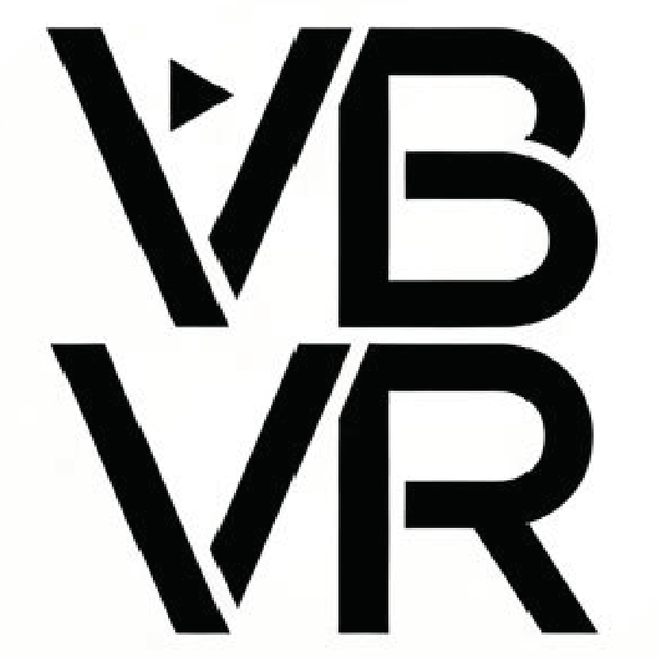

# VBVR-InferKit

Unified inference toolkit for [Very Big Video Reasoning (VBVR)](https://video-reason.com/). Generate videos across **35 video generation models** with a single command.

- **35 Models**: Commercial APIs (Luma, Veo, Kling, Sora, Runway) and open-source models (LTX-Video, LTX-2, HunyuanVideo, SVD, WAN, CogVideoX, and more)
- **Per-model environments**: Isolated venvs with setup scripts for each open-source model
- **VBVR-native**: Discovers tasks from the standard VBVR directory structure

## Quick Start

```bash
# Install
git clone https://github.com/Video-Reason/VBVR-InferKit.git && cd VBVR-InferKit
python -m venv venv && source venv/bin/activate
pip install -e .

# Setup a model
bash setup/install_model.sh --model svd --validate

# Inference
python examples/generate_videos.py --questions-dir setup/test_assets/ --output-dir ./outputs --model svd
```

## API Keys (Commercial Models)

```bash
cp env.template .env
# LUMA_API_KEY=... OPENAI_API_KEY=... GEMINI_API_KEY=... KLING_API_KEY=... RUNWAYML_API_SECRET=...
```

## Docs

| Topic | Link |
|-------|------|
| Inference | [docs/INFERENCE.md](docs/INFERENCE.md) |
| Supported Models | [docs/MODELS.md](docs/MODELS.md) |
| Adding Models | [docs/ADDING_MODELS.md](docs/ADDING_MODELS.md) |
| FAQ | [docs/FAQ.md](docs/FAQ.md) |

---

## Links

- **Website**: [Video-Reason.com](https://video-reason.com/)
- **Paper**: [A Very Big Video Reasoning Suite](https://arxiv.org/abs/2602.20159v1)
- **Slack**: [Join our workspace](https://join.slack.com/t/video-reason/shared_invite/zt-3qqf23icm-UC29fatWWYsIuzRNBR1lgg)
- **HuggingFace**: [Video-Reason](https://huggingface.co/Video-Reason)
- **Contact**: [hokinxqdeng@gmail.com](mailto:hokinxqdeng@gmail.com)

---

## Citation

If you use VBVR in your research, please cite:

```bibtex
@article{vbvr2026,
  title   = {A Very Big Video Reasoning Suite},
  author  = {Wang, Maijunxian and Wang, Ruisi and Lin, Juyi and Ji, Ran and
             Wiedemer, Thadd{\"a}us and Gao, Qingying and Luo, Dezhi and
             Qian, Yaoyao and Huang, Lianyu and Hong, Zelong and Ge, Jiahui and
             Ma, Qianli and He, Hang and Zhou, Yifan and Guo, Lingzi and
             Mei, Lantao and Li, Jiachen and Xing, Hanwen and Zhao, Tianqi and
             Yu, Fengyuan and Xiao, Weihang and Jiao, Yizheng and
             Hou, Jianheng and Zhang, Danyang and Xu, Pengcheng and
             Zhong, Boyang and Zhao, Zehong and Fang, Gaoyun and Kitaoka, John and
             Xu, Yile and Xu, Hua and Blacutt, Kenton and Nguyen, Tin and
             Song, Siyuan and Sun, Haoran and Wen, Shaoyue and He, Linyang and
             Wang, Runming and Wang, Yanzhi and Yang, Mengyue and Ma, Ziqiao and
             Milli{\`e}re, Rapha{\"e}l and Shi, Freda and Vasconcelos, Nuno and
             Khashabi, Daniel and Yuille, Alan and Du, Yilun and Liu, Ziming and
             Lin, Dahua and Liu, Ziwei and Kumar, Vikash and Li, Yijiang and
             Yang, Lei and Cai, Zhongang and Deng, Hokin},
  journal = {arXiv preprint arXiv:2602.20159},
  year    = {2026},
  url     = {https://arxiv.org/abs/2602.20159}
}
```

---

## License

Apache 2.0

<p align="center">
  
</p>
